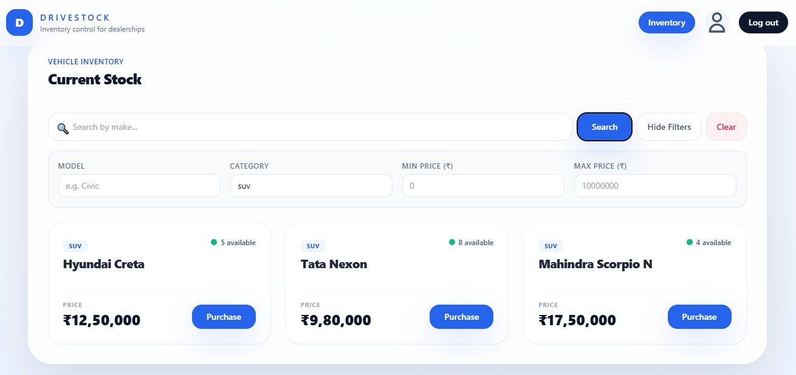

# DriveStock 🚗💼
> A modern, full-stack Car Dealership Inventory Control System built using **FastAPI** (Python) and **React** (Vite + Tailwind CSS).

DriveStock provides car dealerships with a beautiful, responsive, and secure dashboard to track, search, edit, purchase, and restock vehicles. It features role-based access control, real-time stock indicators, and robust input validations.

---

## 🌟 Key Features

- **JWT Authentication**: Secure user registration, password verification, and session token issuance.
- **Role-Based Controls**:
  - **Dealer Agents**: View vehicles, apply advanced search filters, and perform vehicle purchases (automatic stock decrement).
  - **Admins**: Add new vehicles, edit vehicle properties, restock (+1), and delete vehicles.
- **Advanced Search & Filtering**: Instant search by Make, plus collapsible filter toggles for Model, Category, Min Price, and Max Price.
- **Indian Rupee Formatting**: Displays prices using Indian standard format (e.g. `₹12,50,000` via `en-IN` grouping).
- **Duplication Protection**: Double-check constraints prevent adding or editing a vehicle if an identical `(Make, Model, Category, Price)` combination already exists in the catalog.
- **Low Stock Indicator**: Flashing status dots immediately call attention to low stock (under 3 available) or out-of-stock items.

---

## 🛠️ Technology Stack

- **Backend**: Python 3.11+, FastAPI, SQLAlchemy, SQLite, Pydantic, Passlib, python-jose (JWT).
- **Frontend**: React 18, Vite, React Router, Tailwind CSS, Axios.
- **Testing**: Pytest, FastAPI TestClient.

---

## 🚀 Setup & Local Running Instructions

### 1. Backend Setup & Run

1. Navigate to the backend directory:
   ```cmd
   cd DriveStock/backend
   ```
2. Activate the virtual environment:
   - **Command Prompt (cmd)**:
     ```cmd
     venv\Scripts\activate
     ```
   - **PowerShell**:
     ```powershell
     .\venv\Scripts\activate
     ```
3. Install dependencies (if not already installed):
   ```cmd
   pip install -e .[test]
   ```
4. Start the FastAPI development server:
   ```cmd
   uvicorn app.main:app --reload
   ```
   *The backend will be running at `http://127.0.0.1:8000`.*

5. **Create/Upgrade an Admin User**:
   Run the utility script to set up your administrator credentials (replace email/password as desired):
   ```cmd
   venv\Scripts\python.exe create_admin.py admin@drivestock.com admin123
   ```

---

### 2. Frontend Setup & Run

1. Navigate to the frontend directory:
   ```cmd
   cd DriveStock/frontend
   ```
2. Install npm dependencies:
   ```cmd
   npm install
   ```
3. Start the Vite development server:
   ```cmd
   npm run dev
   ```
   *The frontend will run at `http://localhost:5173/`.*

---

## 🧪 Test Suite & Test Report

To run the backend test suite, navigate to the `backend` folder, activate the virtual environment, and run `pytest`:

```cmd
cd DriveStock/backend
venv\Scripts\pytest
```

### Pytest Execution Summary
```text
============================= test session starts =============================
platform win32 -- Python 3.11.x, pytest-8.x.x, pluggy-1.x.x
rootdir: C:\Users\Admin\Desktop\Incubytes project\DriveStock\backend
configfile: pyproject.toml
testpaths: tests
collected 33 items

tests/test_auth_login.py ......                                          [ 18%]
tests/test_auth_register.py ........                                     [ 42%]
tests/test_health.py .                                                   [ 45%]
tests/test_vehicles.py .==================                               [100%]

======================== 33 passed, 3 warnings in 19.17s =======================
```

---

## 📸 Screenshots

*(You can save screenshots of the dashboard inside the `screenshots/` directory)*

- **Dashboard Panel**:
  
- **Filters & Search Panel**:
  
- **Add / Edit Modal & Confirm Password Validation**:
  

---

## 🤖 My AI Usage

### AI Tools Used
- **Antigravity AI Coding Assistant** (powered by Google DeepMind)
- **Gemini** (for contextual code analysis)

### How They Were Used
1. **Troubleshooting Syntax / Parsing Errors**:
   - Fixed an unclosed JSX wrapper tag (`div`) in the main page container which broke compiler/parser rules.
2. **Implementing Confirmation Fields & Frontend Logic**:
   - Assisted in updating the register state, adding the "Confirm Password" UI component, and writing client-side validation logic that filters API payloads.
3. **CORS Configuration**:
   - Integrated `CORSMiddleware` in `backend/app/main.py` to allow cross-origin browser requests and correctly handle HTTP preflight `OPTIONS` calls.
4. **Duplicate Prevention Constraints**:
   - Designed a database validation mechanism in `backend/app/routers/vehicles.py` to block duplicate listings based on the tuple `(Make, Model, Category, Price)`.
   - Wrote accompanying unit tests (`test_create_duplicate_vehicle_returns_bad_request`, `test_update_vehicle_to_duplicate_returns_bad_request`).
5. **Modern Card View & Responsiveness**:
   - Styled cards with Tailwind classes for layout, category badges, dynamic stock-level dots, and Indian number formatting (`en-IN`).
   - Configured responsive headers and overflow scrolling inside the admin form modal.

### Reflection
The collaboration with AI significantly accelerated the development loop. Leveraging the assistant for boilerplate generation, localized layout styling, and context gathering let me concentrate on the software architecture, test validity, and security configurations. Writing unit tests in parallel with the AI-driven implementations ensured that strict constraints were maintained without introducing regressions.