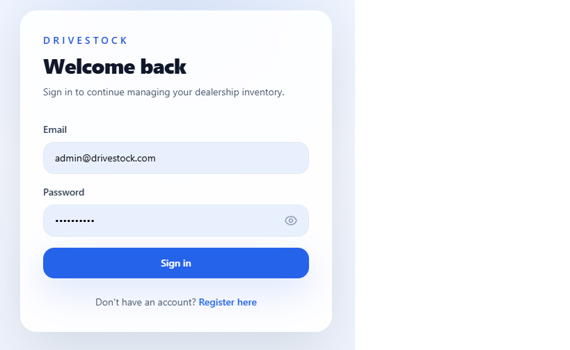
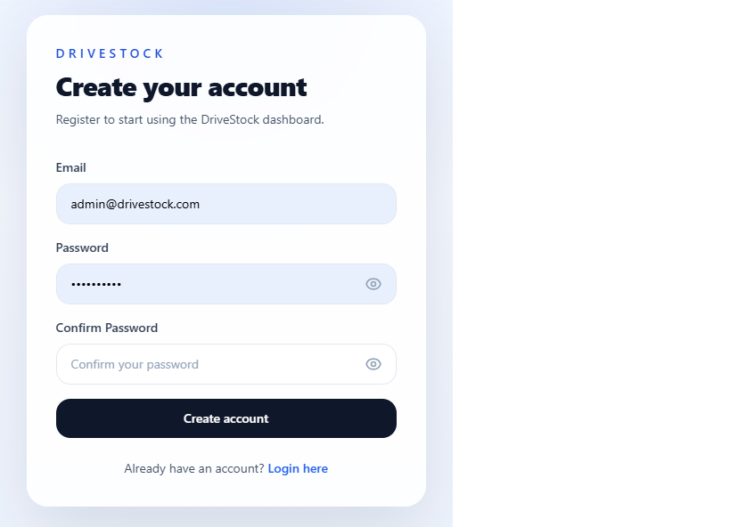
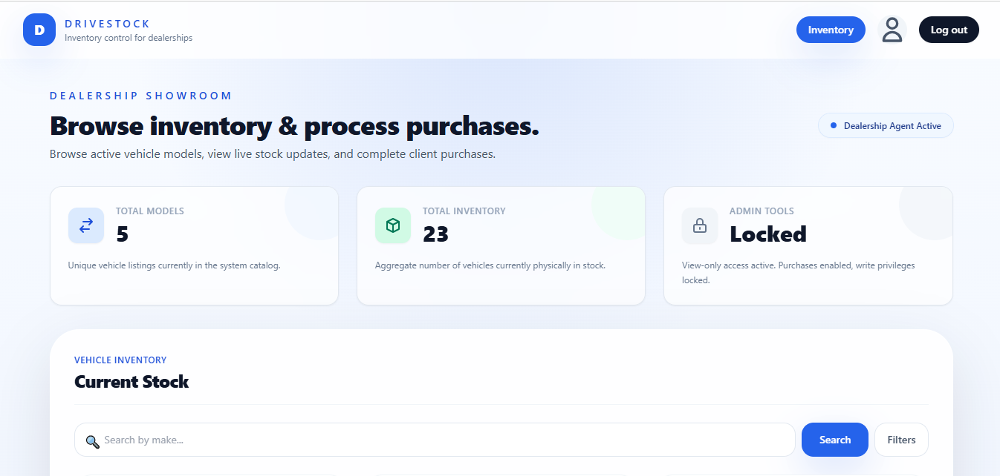
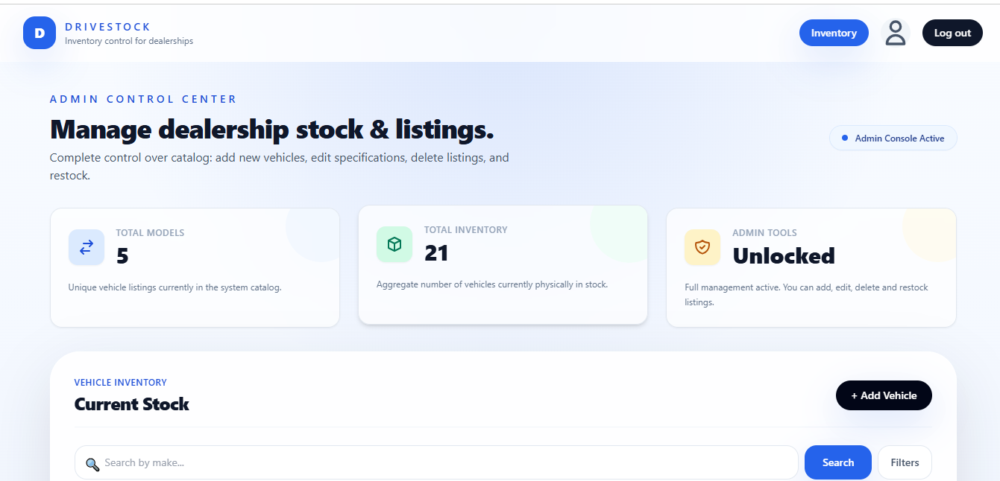
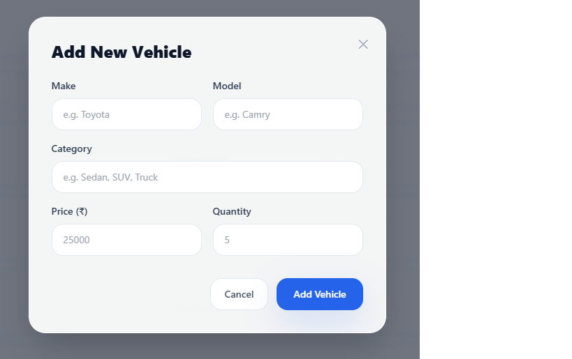
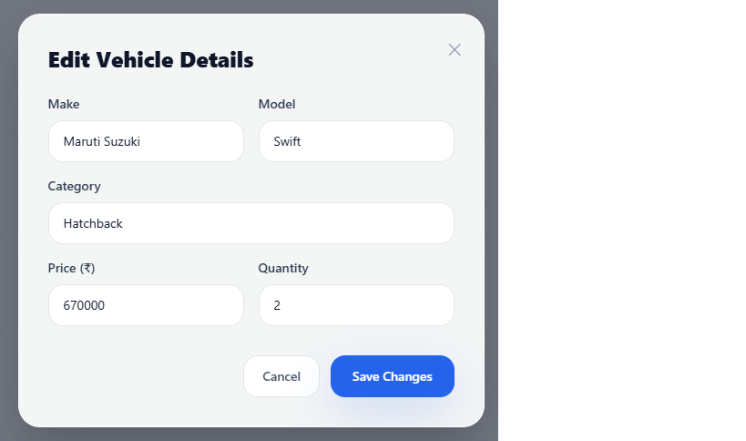

# DriveStock 🚗💼
> A modern, full-stack Car Dealership Inventory Control System built using **FastAPI** (Python) and **React** (Vite + Tailwind CSS).

DriveStock provides car dealerships with a beautiful, responsive, and secure dashboard to track, search, edit, purchase, and restock vehicles. It features role-based access control, real-time stock indicators, and robust input validations.

---

## 🌟 Key Features

- **JWT Authentication**: Secure user registration, password verification, and session token issuance.
- **Role-Based Controls**:
  - **Dealer Agents**: View vehicles, apply advanced search filters, and perform vehicle purchases (automatic stock decrement).
  - **Admins**: Add new vehicles, edit vehicle properties, restock (+1), and delete vehicles.
- **Dynamic Role Customizations**: Page headings, subtitles, and controls dynamically adjust depending on the user's role (Admin vs Dealer Agent).
- **Admin Catalog List View**: Switches the card grid layout to a horizontal list stack for easier catalog and stock management.
- **Advanced Search & Filtering**: Instant search by Make, plus collapsible filter toggles for Model, Category, Min Price, and Max Price.
- **Indian Rupee Formatting**: Displays prices using Indian standard format (e.g. `₹12,50,000` via `en-IN` grouping).
- **Duplication Protection**: Double-check constraints prevent adding or editing a vehicle if an identical `(Make, Model, Category, Price)` combination already exists in the catalog.
- **Interactive Action Loaders**: Standardized 1-second loading transitions with circular rotating spinners inside buttons to prevent double click submissions.
- **Toast Notifications**: Slide-in bottom-right alert toast banners for successful operations and detailed validation error messages.
- **Password Visibility Toggles**: Integrated show/hide eye-icon buttons inside login and register password inputs.
- **Responsive Mobile Drawer**: Collapses headers on small viewports and provides a clean slide-out menu drawer.
- **Low Stock Indicator**: Flashing status dots immediately call attention to low stock (under 3 available) or out-of-stock items.

---

## 🛠️ Technology Stack

- **Backend**: Python 3.11+, FastAPI, SQLAlchemy, SQLite, Pydantic, Passlib, python-jose (JWT).
- **Frontend**: React 18, Vite, React Router, Tailwind CSS, Axios.
- **Testing**: Pytest, FastAPI TestClient.

---

## 🚀 Setup & Local Running Instructions

### 1. Backend Setup & Run

1. Navigate to the backend directory:
   ```cmd
   cd DriveStock/backend
   ```
2. Activate the virtual environment:
   - **Command Prompt (cmd)**:
     ```cmd
     venv\Scripts\activate
     ```
   - **PowerShell**:
     ```powershell
     .\venv\Scripts\activate
     ```
3. Install dependencies (if not already installed):
   ```cmd
   pip install -e .[test]
   ```
4. Start the FastAPI development server:
   ```cmd
   uvicorn app.main:app --reload
   ```
   *The backend will be running at `http://127.0.0.1:8000`.*

5. **Create/Upgrade an Admin User**:
   Run the utility script to set up your administrator credentials (replace email/password as desired):
   ```cmd
   venv\Scripts\python.exe create_admin.py admin@drivestock.com admin123
   ```

---

### 2. Frontend Setup & Run

1. Navigate to the frontend directory:
   ```cmd
   cd DriveStock/frontend
   ```
2. Install npm dependencies:
   ```cmd
   npm install
   ```
3. Start the Vite development server:
   ```cmd
   npm run dev
   ```
   *The frontend will run at `http://localhost:5173/`.*

---

## 🧪 Test Suite & Test Report

To run the backend test suite, navigate to the `backend` folder, activate the virtual environment, and run `pytest`:

```cmd
cd DriveStock/backend
venv\Scripts\pytest
```

### Pytest Execution Summary
```text
.................................                                         [100%]
=============================== warnings summary =============================== 
venv\Lib\site-packages\fastapi\testclient.py:1
  c:\Users\Admin\Desktop\Incubytes project\DriveStock\backend\venv\Lib\site-packages\fastapi\testclient.py:1: StarletteDeprecationWarning: Using `httpx` with `starlette.testclient` is deprecated; install `httpx2` instead.
    from starlette.testclient import TestClient as TestClient  # noqa

app\main.py:19
  C:\Users\Admin\Desktop\Incubytes project\DriveStock\backend\app\main.py:19: DeprecationWarning:
          on_event is deprecated, use lifespan event handlers instead.

          Read more about it in the
          [FastAPI docs for Lifespan Events](https://fastapi.tiangolo.com/advanced/events/).

    @app.on_event("startup")

venv\Lib\site-packages\fastapi\applications.py:4675
  c:\Users\Admin\Desktop\Incubytes project\DriveStock\backend\venv\Lib\site-packages\fastapi\applications.py:4675: DeprecationWarning:
          on_event is deprecated, use lifespan event handlers instead.

          Read more about it in the
          [FastAPI docs for Lifespan Events](https://fastapi.tiangolo.com/advanced/events/).

    return self.router.on_event(event_type)  # ty: ignore[deprecated]

-- Docs: https://docs.pytest.org/en/stable/how-to/capture-warnings.html
33 passed, 3 warnings in 17.69s
```

---

## 📸 Screenshots

- **Login Screen**:
  
- **Register Screen**:
  
- **Dealer Agent Showroom**:
  
- **Advanced Search & Filtering**:
  
- **Admin Control Center (List Layout)**:
  
- **Add & Edit Vehicle Dialogs**:
  
  

---

## 🤖 My AI Usage

### AI Tools Used
- **Git Copilot** (powered by OpenAI) — Used for code generation, autocomplete suggestions, boilerplate templates, and building backend unit test frameworks.
- **Antigravity AI Coding Assistant** (powered by Google DeepMind) — Used for layout refactoring (grid to admin list stack), responsive mobile navigation drawer, password toggles, action loading spinners, and toast notification popups.

### How They Were Used
1. **Troubleshooting Syntax / Parsing Errors**:
   - Fixed an unclosed JSX wrapper tag (`div`) in the main page container which broke compiler/parser rules.
2. **Implementing Confirmation Fields & Frontend Logic**:
   - Assisted in updating the register state, adding the "Confirm Password" UI component, and writing client-side validation logic that filters API payloads.
3. **CORS Configuration**:
   - Integrated `CORSMiddleware` in `backend/app/main.py` to allow cross-origin browser requests and correctly handle HTTP preflight `OPTIONS` calls.
4. **Duplicate Prevention Constraints**:
   - Designed a database validation mechanism in `backend/app/routers/vehicles.py` to block duplicate listings based on the tuple `(Make, Model, Category, Price)`.
   - Wrote accompanying unit tests (`test_create_duplicate_vehicle_returns_bad_request`, `test_update_vehicle_to_duplicate_returns_bad_request`).
5. **Modern Card View & Responsiveness**:
   - Styled cards with Tailwind classes for layout, category badges, dynamic stock-level dots, and Indian number formatting (`en-IN`).
   - Configured responsive headers and overflow scrolling inside the admin form modal.
6. **Responsive Hamburger Drawer Navigation**:
   - Programmed a custom CSS-animated drawer overlay that slides out from the left on mobile devices, organizing navigation links and profile parameters.
7. **Admin Horizontal List Layout**:
   - Implemented dynamic conditional templates in `App.jsx` to render horizontal row list items for administrators and 3-column catalog grids for showroom agents.
8. **Interactive Show & Hide Passwords**:
   - Structured password input fields with custom SVG eye icon triggers and local visibility states on the Login and Register screens.
9. **Action Spinners & Toast Banner Notifications**:
   - Configured button components (Purchase, Restock, Delete, and Modal submit) to disable and render an inline loading graphic on click for 1 second.
   - Built a bottom-right fixed notification container that displays success and error banners dynamically.

### Reflection
The collaboration with AI significantly accelerated the development loop. Leveraging the assistant for boilerplate generation, responsive design alignment, state transitions, and context gathering let me concentrate on the software architecture, TDD coverage, and database validations. Writing unit tests in parallel with the AI-driven implementations ensured that strict constraints were maintained without introducing regressions. The AI's ability to help write layout adjustments saved considerable time when refactoring from grids to tabular list row strips.