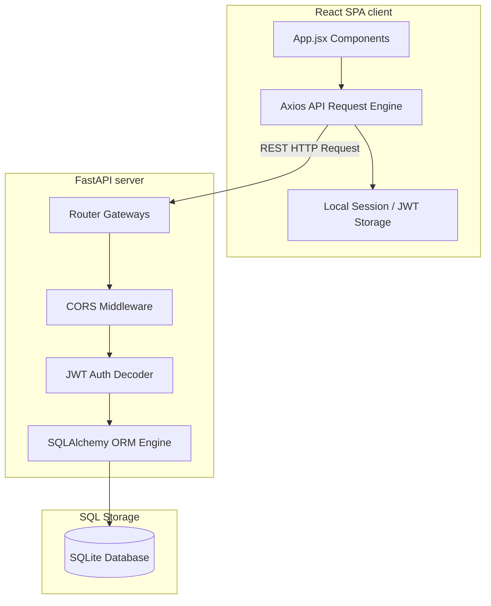
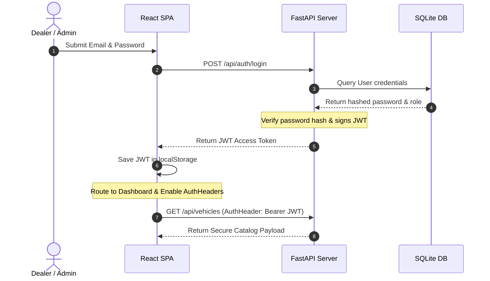

# DriveStock | Car Dealership Inventory System Documentation


---

## 📖 Project Overview

**DriveStock** is a secure, high-fidelity Car Dealership Inventory Management System designed to bridge the gap between dealership clients and dealer agents.

* **For Dealer Agents (Customers)**: The system provides a visually stunning, responsive showroom to browse available models, filter by specifications (category, model, price), view detailed inventories, and complete client purchases.
* **For Administrators**: The system unlocks a complete control dashboard allowing catalog additions, vehicle editing, catalog cleaning (deletions), inventory restocking, and real-time statistics analysis.

> [!NOTE]
> The system utilizes a strict Test-Driven Development (TDD) cycle to guarantee transaction safety, coordinate role validation, and prevent listing duplicates.

---

## ✨ Features

### 🔑 Customer (Dealer Agent) Features
* **Authentication**: Seamless secure registration and login utilizing JWT session authorization.
* **Showroom Catalog**: A sleek card-grid showcase with dynamic availability indicators.
* **Dynamic Search & Filtering**: Filters for vehicle category, model name, and price ranges.
* **Interactive Purchases**: A single-click "Purchase" action that decrements quantity, locks out double-click requests, and triggers interactive toast alerts.
* **Responsive Layouts**: Responsive navigation drawer overlay optimized for mobile viewports.

### 🛡️ Admin Features
* **Role Enforcement**: Protected views and API gateways restricted to administrators.
* **Inventory Control Center**: An alternative tabular list strip layout optimized for catalog reviews.
* **Add / Edit Modal**: Form validating pricing ranges, category mappings, and inputs.
* **Direct Deletions**: Easy catalog cleaning triggers with confirmation popups.
* **Inventory Restock**: In-line single click restock buttons (+1 quantity) with animated load spinners.
* **System Stats Panel**: High-impact statistics widgets showcasing total unique models, in-stock vehicles, and current authorization parameters.

---

## 🏗️ System Architecture



### Frontend Architecture
* **React 18**: Dynamic single-page application framework.
* **Vite**: Ultra-fast build tool and local dev server setup.
* **Tailwind CSS**: Utility-first styling enabling dynamic animations and responsive states.
* **React Router**: Layout nesting and auth-routing guards (`AuthGate`).
* **Axios**: HTTP communication layer with token interceptors.

### Backend Architecture
* **Python / FastAPI**: Asynchronous RESTful API framework.
* **Uvicorn**: Lightweight ASGI web server.
* **JWT Authentication**: Secure token signing (via `python-jose`) and encryption (via `passlib` / `bcrypt`).
* **REST API**: Structured JSON payload endpoints.

### Database Architecture
* **SQLite / SQLAlchemy ORM**: Localized SQLite database instance (`backend/drivestock.db`) managed via SQLAlchemy models and connection engines.

---

## 📁 Folder Structure

```text
DriveStock/
├── backend/                   # FastAPI Backend Application
│   ├── app/
│   │   ├── models/            # SQLAlchemy Database Models
│   │   ├── routers/           # Auth and Vehicle REST API Route Controllers
│   │   ├── schemas/           # Pydantic Schemas for Input Validation
│   │   ├── database.py        # SQLite Database Connection Setup
│   │   └── main.py            # FastAPI App Initializer and CORS Configuration
│   ├── tests/                 # Backend Pytest Test Suites
│   ├── create_admin.py        # Admin Creation/Upgrading Utility script
│   └── setup.py               # Dependency mappings and requirements
│
└── frontend/                  # React Vite Frontend Application
    ├── src/
    │   ├── assets/            # Static asset resources
    │   ├── lib/               # Auth APIs and Token Storage Helpers
    │   ├── src/App.jsx        # Root SPA Application, Routes, and Pages
    │   ├── src/index.css      # Core Tailwind CSS base mappings
    │   └── src/styles.css     # Keyframe animations and custom CSS utilities
    ├── index.html             # Client Mount Entrypoint
    └── tailwind.config.js     # Color tokens and custom shadow extends
```

---

## 🔌 API Endpoints

| Category | HTTP Method | Endpoint | Description | Authentication |
| :--- | :--- | :--- | :--- | :--- |
| **Auth** | `POST` | `/api/auth/register` | Create a new user account | Public |
| **Auth** | `POST` | `/api/auth/login` | Authenticate credentials & return JWT | Public |
| **Vehicles** | `GET` | `/api/vehicles` | Retrieve list of all available vehicles | Protected (JWT) |
| **Vehicles** | `GET` | `/api/vehicles/search`| Filter vehicles by make, model, type, or price | Protected (JWT) |
| **Vehicles** | `POST` | `/api/vehicles` | Add a new vehicle to the catalog | Protected (Admin Only) |
| **Vehicles** | `PUT` | `/api/vehicles/:id` | Update vehicle specifications | Protected (Admin Only) |
| **Vehicles** | `DELETE` | `/api/vehicles/:id` | Remove a vehicle from listings | Protected (Admin Only) |
| **Inventory**| `POST` | `/api/vehicles/:id/purchase`| Purchase a vehicle (decrease stock) | Protected (JWT) |
| **Inventory**| `POST` | `/api/vehicles/:id/restock` | Restock inventory (increase stock) | Protected (Admin Only) |

---

## 🔐 Authentication Flow



---

## 🗄️ Database Schemas

### 🚗 Vehicle Model

* **ID**: `Integer` (Primary Key, Auto-increment)
* **Make**: `String` (Required, e.g., `"Toyota"`)
* **Model**: `String` (Required, e.g., `"Camry"`)
* **Category**: `String` (Required, e.g., `"SUV"`)
* **Price**: `Integer` (Required, positive values only)
* **Quantity**: `Integer` (Required, current stock level)

### 👤 User Model

* **ID**: `Integer` (Primary Key, Auto-increment)
* **Email**: `String` (Unique, Required)
* **Password**: `String` (Bcrypt encrypted hash)
* **Role**: `String` (e.g., `"admin"` or `"agent"`)

---

## 📸 Screenshots

| View Description | Placeholder / Reference Link |
| :--- | :--- |
| **Login Screen** | `[View login.png](./screenshots/login.png)` |
| **Register Screen** | `[View register.png](./screenshots/register.png)` |
| **Dealer Agent Showroom** | `[View dashboard1.png](./screenshots/dashboard1.png)` |
| **Advanced Search & Filtering** | `[View filters.png](./screenshots/filters.png)` |
| **Admin Control Center (List Layout)**| `[View admin1.png](./screenshots/admin1.png)` |
| **Add Vehicle Dialog** | `[View add_vehicle.png](./screenshots/add_vehicle.png)` |
| **Edit Vehicle Dialog** | `[View edit_vehicle.png](./screenshots/edit_vehicle.png)` |

---

## 🔍 Search & Filtering

The search utility utilizes a combination of text filters and boundary filters to locate listings:

* **Text Filters**: Matches vehicle `Make`, `Model` (case-insensitive substring match), and `Category` parameters.
* **Boundary Filters**: Restricts results based on price ranges (`min_price` and `max_price`).
* **Validation**:
  * Minimum price values cannot be negative.
  * Maximum price constraints must sit above or equal to minimum limits.

---

## 📦 Inventory Management

* **Stock Mappings**: Each listing keeps a strict count of `Quantity` values.
* **Auto-purchase lock**: Dealer Agents purchasing a vehicle trigger stock decrements. If `Quantity === 0`, the button changes state to **Sold Out** and is disabled.
* **Restocking (+1)**: Admin users can hit the **Restock (+1)** button to increment stock immediately. High-impact spinners indicate active transaction states during connection times.

---

## 🛡️ Security Measures

> [!IMPORTANT]
> Security is integrated into the core database level, API routers, and local interfaces.

* **JWT Verification**: Bearer tokens are required for all protected endpoints.
* **Bcrypt Encryption**: Hashed passwords prevent raw credential leaks in case of compromise.
* **Admin Verification**: Direct middleware checking on `/restock`, `POST`, `PUT`, and `DELETE` endpoints.
* **Duplication Prevention**: A constraint mechanism rejects entries if an identical Make, Model, Category, and Price combination exists.

---

## 🚀 Installation & Local Run

### Backend Setup
```bash
# Navigate to backend
cd backend

# Activate virtualenv (Windows)
.\venv\Scripts\activate

# Install setup in test development mode
pip install -e .[test]

# Run FastAPI server
uvicorn app.main:app --reload
```

### Frontend Setup
```bash
# Navigate to frontend
cd frontend

# Install package nodes
npm install

# Run Vite dev server
npm run dev
```

---

## ⚙️ Environment Variables

### Frontend (`.env`)
```env
VITE_API_BASE_URL=http://127.0.0.1:8000
```

### Backend (`.env`)
```env
PORT=8000
SQLITE_DB_URL=sqlite:///drivestock.db
JWT_SECRET=super_secure_key_for_drivestock_jwt_token_auth
```

---

## 🔮 Future Roadmap

- [ ] **Wishlist**: Allow agents to flag vehicles for follow-ups.
- [ ] **Compare Engine**: Multi-car column grid parameter comparisons.
- [ ] **Booking Manager**: Direct client test-drive booking calendar tools.
- [ ] **Interactive Reviews**: User reviews on make/model variants.
- [ ] **Visual Uploads**: Direct S3 photo uploads for vehicle models.
- [ ] **Sales Analytics**: Sales conversion graphs and dealer metrics dashboards.

---

## 👥 Contributors

* **Lead Developer**: Pradip K. Mokariya
* **Collaborative AI Assistants**: Git Copilot & Antigravity AI Assistant

---
